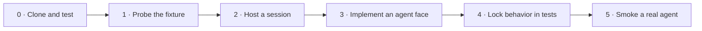

# Subspace developer guide

This guide takes you from a clean checkout to a real Agent Client Protocol
(ACP) session. Each level adds one concept. Stop at the level that meets your
need.

The guide describes `deftai/subspace` `main` at merge commit
`6e626f3d894b97143bc995f566af8c8330913694`.

## Glossary

| Term | Meaning |
|------|---------|
| ACP | Agent Client Protocol. A host uses it to create an agent session, send a prompt, receive updates, and cancel work. |
| DX | Developer experience. It is the path from setup to a useful result. |
| stdio | Standard input and standard output. Subspace uses these byte streams to connect a host process to an agent process. |
| NDJSON | Newline-delimited JSON. Each line is one JSON message at the stdio boundary. |
| reverse RPC | A request that the agent sends back to the host, such as a permission request. |
| fixture | A small, controlled agent used in tests. It proves Subspace behavior, but it is not an external agent product. |
| MCP | Model Context Protocol. It is not implemented as a Subspace product layer in this release. `mcpServers: []` is an ACP session field that real agents require. |

## Choose your path



| If you want to… | Go to |
|-----------------|-------|
| Confirm that the repository works | Level 0 |
| Test one agent command from a terminal | Level 1 |
| Add ACP sessions to a host application | Level 2 |
| Build the ACP-facing part of an agent | Level 3 |
| Reuse behavior scenarios in tests | Level 4 |
| Check interoperability with an installed agent | Level 5 |

## User stories

| Level | User story |
|-------|------------|
| 0 | As a contributor, I want one setup and test command sequence so that I can confirm my environment. |
| 1 | As an integrator, I want a small command-line probe so that I can separate agent startup faults from application faults. |
| 2 | As a host developer, I want one session product so that I can create, resume, prompt, cancel, and apply a safe permission policy. |
| 2 | As a host developer, I want streamed session events so that I can show agent progress before the turn ends. |
| 3 | As an agent developer, I want a thin request façade so that I can implement ACP methods and request host permission. |
| 4 | As a package maintainer, I want reusable scenarios so that linked and stdio behavior do not drift apart. |
| 5 | As a release operator, I want an honest external smoke test so that a fixture pass is not mistaken for interoperability proof. |

## Package map

| Package | Use it when you need… |
|---------|-----------------------|
| `@deft/subspace-foundation` | Protocol-neutral transport, framing, and codec primitives |
| `@deft/acp-wire` | ACP messages over linked in-process channels or stdio NDJSON |
| `@deft/acp-client` | A host-side client and the session product |
| `@deft/acp-agent` | An agent-side server façade and the session-echo fixture |
| `@deft/acp-probe` | A one-turn stdio command-line smoke test |
| `@deft/acp-testkit` | Importable scenarios, harnesses, and assertions |
| `@deft/acp-harness` | An early ACP agent loop with a local stub model over linked or stdio transport |

All seven package faces are version `0.1.0`. The root monorepo is private only
to prevent accidental publication as one package. See the
[package metadata at this guide's tip](https://github.com/deftai/subspace/tree/6e626f3d894b97143bc995f566af8c8330913694/packages).

### Current stub harness and DX helpers

`@deft/acp-harness` now serves ACP through a local `StubModelAdapter`. The
repository proves linked and stdio turns, streamed updates, and cancellation.
It is not a production coding agent and it has no real model provider or tool
loop. See the
[`@deft/acp-harness` README](../packages/acp-harness/README.md) for its short
happy path.

The first DX pass also shipped shared `@deft/acp-agent` helpers:
`promptToText`, `agentMessageChunkUpdate`, `notifyAgentMessageChunk`,
`defaultInitializeResult`, and `createDeferredBridge`. Harness defaults live
in `resolveHarnessOptions`, and the harness source is split by model, session,
options, handlers, and listen concerns. These are small progressive helpers,
not a general handlers framework.

## Level 0 — clone, install, and test

**Outcome:** You have a working checkout and a green full suite.

Requirements:

- Node.js 22 or later
- `pnpm` 9.15.0 through Corepack, or a compatible `pnpm` installation
- Git

```bash
git clone https://github.com/deftai/subspace.git
cd subspace
corepack enable
pnpm install
pnpm test
```

The root `test` script runs all five suite files: wire, client product, probe,
testkit, and harness. You can also check the TypeScript source syntax:

```bash
pnpm typecheck
```

The packages export TypeScript source. Node runs it with
`--experimental-strip-types`; there is no `dist` build in version `0.1.0`.
The commands above are the supported development path. Sources:
[root package script](https://github.com/deftai/subspace/blob/6e626f3d894b97143bc995f566af8c8330913694/package.json) and
[phase-0 close](https://github.com/deftai/subspace/blob/6e626f3d894b97143bc995f566af8c8330913694/RESEARCH/SUBSPACE_PHASE0_CLOSE.md).

## Level 1 — use `acp-probe` as a screwdriver

**Outcome:** You can start one ACP agent command, send one prompt, inspect the
event transcript, and interpret the exit code.

First, use the in-repository session-echo fixture as a control:

```bash
pnpm exec node --experimental-strip-types packages/acp-probe/bin/acp-probe.ts \
  --command node \
  --arg --experimental-strip-types \
  --arg packages/acp-agent/bin/session-echo-agent.ts \
  --prompt "hello from the probe" \
  --permission deny \
  --cwd "$PWD" \
  --timeout 15000
```

The probe writes one JSON event per line to standard output. It writes its
summary to standard error.

| Exit | Meaning | First check |
|------|---------|-------------|
| `0` | The session and prompt completed | Inspect `update` and `prompt_done` events |
| `1` | A flag or required value is invalid | Run with `--help` |
| `2` | The agent, transport, or prompt failed | Check the error and agent command |
| `3` | The wall-clock timeout expired | Check agent startup, then increase `--timeout` if justified |

`--arg` is repeatable. `--cwd` sets both the child process working directory
and the `session/new` working directory. The only permission modes are:

- `deny`: deny every reverse permission request. This is the default.
- `approve-reads`: allow read, `read_file`, search, and list requests; deny
  writes.

There is no `approve-all` path. Source:
[`acp-probe` parser and exit contract](https://github.com/deftai/subspace/blob/6e626f3d894b97143bc995f566af8c8330913694/packages/acp-probe/src/index.ts).

The session-echo command is a fixture. A pass proves the Subspace control path.
It does not prove that an external agent is installed or authenticated.

## Level 2 — host an ACP session

**Outcome:** You can spawn an agent over stdio, create a session, stream a
prompt, cancel it, and close the connection.

Create `.scratch/host-session.ts` in the repository:

```ts
import { defineStdioTransport } from "@deft/acp-wire";
import { defineAcpClientProduct } from "@deft/acp-client";

const transport = await defineStdioTransport({
  mode: "spawn",
  command: process.execPath,
  args: [
    "--experimental-strip-types",
    "packages/acp-agent/bin/session-echo-agent.ts",
  ],
  cwd: process.cwd(),
}).connect();

const product = await defineAcpClientProduct({
  permissionPolicy: "deny",
}).connect(transport);

try {
  const session = await product.sessions.ensure("tutorial", {
    cwd: process.cwd(),
    mcpServers: [],
    providerId: "session-echo",
  });

  for await (const event of session.prompt("hello from my host")) {
    if (event.type === "update") {
      console.log("update", event.update);
    } else if (event.type === "prompt_done") {
      console.log("done", event.result);
    } else if (event.type === "prompt_error") {
      console.error("prompt error", event.error);
    } else if (event.type === "permission") {
      console.log("permission", event.outcome, event.params);
    }
  }
} finally {
  await product.close();
}
```

Run it:

```bash
node --experimental-strip-types .scratch/host-session.ts
```

The product sends `initialize` when it connects. It sends `cwd` and
`mcpServers` on `session/new`; the defaults are `process.cwd()` and `[]`.
These fields are important for external agents.

The main session operations are:

| Operation | Use |
|-----------|-----|
| `sessions.create(params)` | Create a new agent session |
| `sessions.load(acpSessionId)` | Load a known ACP session |
| `sessions.ensure(key, params)` | Reuse a host-mapped session or create it |
| `session.prompt(input)` | Return an asynchronous stream of agent events |
| `session.cancel()` | Cancel the active prompt without closing the session |
| `session.softClose()` | Mark the host record closed; `ensure` can resume it |
| `product.close()` | Close the client and transport |

`localId`, `acpSessionId`, and `providerId` have different meanings. Do not
merge them into one identifier. The in-memory store is host bookkeeping. It is
not an agent run store or test result store. Source:
[`defineAcpClientProduct`](https://github.com/deftai/subspace/blob/6e626f3d894b97143bc995f566af8c8330913694/packages/acp-client/src/index.ts).

To cancel a slow prompt, collect the stream and cancel from another task:

```ts
import { collectEvents } from "@deft/acp-client";

const eventsPromise = collectEvents(session.prompt("slow"));
setTimeout(() => void session.cancel(), 50);
const events = await eventsPromise;
```

One first-in, first-out queue owns prompts for a client connection. Do not
expect prompts on the same connection to run in parallel.

### Linked transport instead of stdio

Use linked channels when the host and agent run in one process:

```ts
import { defineLinkedChannels } from "@deft/acp-wire";
import { listenSessionEcho } from "@deft/acp-agent";
import { defineAcpClientProduct } from "@deft/acp-client";

const { client, agent } = defineLinkedChannels().connect();
const server = await listenSessionEcho(agent);
const product = await defineAcpClientProduct().connect(client);

try {
  const session = await product.sessions.create();
  for await (const event of session.prompt("linked hello")) {
    console.log(event);
  }
} finally {
  await product.close();
  await server.close();
}
```

The client product API stays the same. Only the transport changes.

## Level 3 — implement an agent face and reverse RPC

**Outcome:** You can dispatch ACP requests on the agent side, send updates, and
ask the host for permission.

`defineAcpServer` accepts a method-to-handler map. After `listen`, its handle
can send notifications and reverse requests. The important pattern is:

Create `.scratch/agent-face.ts` in the repository:

```ts
import {
  defineAcpServer,
  type AcpServerHandle,
} from "@deft/acp-agent";
import { defineLinkedChannels } from "@deft/acp-wire";
import { defineAcpClientProduct } from "@deft/acp-client";

const { client, agent } = defineLinkedChannels().connect();
let handle: AcpServerHandle;

const server = defineAcpServer({
  handlers: {
    async initialize() {
      return {
        protocolVersion: 1,
        agentCapabilities: {},
        agentInfo: { name: "tutorial-agent", version: "0.1.0" },
      };
    },

    async "session/new"() {
      return { sessionId: crypto.randomUUID() };
    },

    async "session/prompt"(params) {
      const input = params as { sessionId: string; prompt: unknown };

      const permission = await handle.request("session/request_permission", {
        sessionId: input.sessionId,
        toolCall: { kind: "read", title: "read project file" },
      });

      await handle.notify("session/update", {
        sessionId: input.sessionId,
        update: {
          sessionUpdate: "agent_message_chunk",
          content: {
            type: "text",
            text: `host permission result: ${JSON.stringify(permission)}`,
          },
        },
      });

      return { stopReason: "end_turn" };
    },

    async "session/cancel"() {
      return null;
    },
  },
});

handle = await server.listen(agent);

const product = await defineAcpClientProduct({
  permissionPolicy: "approve-reads",
}).connect(client);

try {
  const session = await product.sessions.create();
  for await (const event of session.prompt("show permission flow")) {
    console.log(event);
  }
} finally {
  await product.close();
  await handle.close();
}
```

Run it:

```bash
node --experimental-strip-types .scratch/agent-face.ts
```

For a ready-made fixture, use `listenSessionEcho(transport)`. Its source shows
session state, multi-turn updates, cancellation, and reverse permission
requests:
[`@deft/acp-agent`](https://github.com/deftai/subspace/blob/6e626f3d894b97143bc995f566af8c8330913694/packages/acp-agent/src/index.ts).

The session-echo implementation accepts a plain string prompt for simple
tests. Real ACP agents expect content blocks, such as:

```ts
await session.prompt([{ type: "text", text: "Summarize this project." }]);
```

`acp-probe` converts its `--prompt` text to this content-block form.

## Level 4 — lock behavior with `@deft/acp-testkit`

**Outcome:** You can run the standard scenarios and add one focused
multi-turn check.

Run the built-in minimum set:

```ts
import { runMinimumScenarios } from "@deft/acp-testkit";

const results = await runMinimumScenarios();
console.table(results);
```

The minimum set covers:

- linked multi-turn behavior;
- linked cancellation and session survival;
- linked reverse permissions for `deny` and `approve-reads`;
- stdio multi-turn behavior.

The repository suite also runs stdio cancellation. It does not claim a full
scenario-by-transport matrix.

Here is a Node test that uses the testkit harness and assertions:

```ts
import { test } from "node:test";
import {
  withLinkedProduct,
  collectEvents,
  assertPromptDone,
  assertTextIncludes,
} from "@deft/acp-testkit";

test("my host keeps one session across two turns", async () => {
  const harness = await withLinkedProduct({
    permissionPolicy: "deny",
  });

  try {
    const session = await harness.product.sessions.create({
      cwd: process.cwd(),
    });

    const first = await collectEvents(session.prompt("first"));
    assertPromptDone(first);
    assertTextIncludes(first, "turn:1:first");

    const second = await collectEvents(session.prompt("second"));
    assertPromptDone(second);
    assertTextIncludes(second, "turn:2:second");
  } finally {
    await harness.dispose();
  }
});
```

Run a test file with Node 22:

```bash
node --experimental-strip-types --test path/to/my-host.test.ts
```

Other public helpers include `withStdioProduct`, `runMultiTurn`,
`runCancelMidPrompt`, `runPermissionReverse`, `assertCancelled`,
`assertHasUpdate`, and `assertPermissionOutcome`. Source:
[`@deft/acp-testkit` exports](https://github.com/deftai/subspace/blob/6e626f3d894b97143bc995f566af8c8330913694/packages/acp-testkit/src/index.ts).

## Level 5 — smoke a real agent

**Outcome:** You can test an ACP agent that is already installed on your
machine without treating it as a permanent test dependency.

Use the same probe, but replace the fixture command:

```bash
pnpm exec node --experimental-strip-types packages/acp-probe/bin/acp-probe.ts \
  --command grok-acp \
  --cwd "$PWD" \
  --prompt "Reply with exactly: SMOKE_OK" \
  --permission deny \
  --timeout 60000
```

For another agent, change `--command` and repeat `--arg` for any required
arguments:

```bash
pnpm exec node --experimental-strip-types packages/acp-probe/bin/acp-probe.ts \
  --command claude-code-acp \
  --cwd "$PWD" \
  --prompt "Reply with exactly: SMOKE_OK" \
  --permission deny \
  --timeout 60000
```

These commands require the named binary, its credentials, and any provider
access that it needs. A missing binary, failed authentication, provider
failure, or ACP error must stay a failure. Do not replace it with a fixture
pass.

The external research first found that real agents rejected `session/new`
without `cwd` and `mcpServers`. The merged schema fix now:

1. sends `initialize` before `session/new`;
2. always sends `cwd` and `mcpServers`;
3. aligns probe `--cwd` with the child process and the ACP session; and
4. formats RPC errors as readable text.

The post-fix product shape is tested in the repository. A real-agent run is a
manual smoke test, not a permanent continuous-integration matrix. Sources:
[phase-0 external smoke summary](../RESEARCH/SUBSPACE_PHASE0_CLOSE.md).

### Honest failure checklist

| Symptom | Check |
|---------|-------|
| Exit `1` | Probe flags and required values |
| Exit `2` with `ENOENT` | Agent binary name and `PATH` |
| Exit `2` with an RPC error | Agent ACP version, required fields, and agent logs |
| Exit `2` with an auth or provider error | Agent credentials and provider access |
| Exit `3` | Agent startup time, network access, and the timeout value |
| Fixture passes, external agent fails | Treat the external result as a real interoperability fault; do not report green |

## Consume Subspace

### Path A — use the monorepo

This is the recommended path for development now:

```bash
git clone https://github.com/deftai/subspace.git
cd subspace
corepack enable
pnpm install
pnpm test
```

After installation, workspace imports such as `@deft/acp-client` resolve by
package name.

### Path B — pack tarballs without a registry

Pack in dependency order from an installed checkout:

```bash
pnpm --filter @deft/subspace-foundation pack
pnpm --filter @deft/acp-wire pack
pnpm --filter @deft/acp-client pack
pnpm --filter @deft/acp-agent pack
pnpm --filter @deft/acp-probe pack
pnpm --filter @deft/acp-testkit pack
pnpm --filter @deft/acp-harness pack
```

Install the resulting `.tgz` files in a consumer with `file:` dependencies.
The packages currently export TypeScript source, so consumers need Node 22 or
later and the same type-stripping runtime approach.

The packages use `workspace:*` for internal dependencies. Registry publication
must rewrite or pack those dependencies in order. This step is documented but
is not automated.

### Path C — npm registry residual

The seven package faces have public version `0.1.0` metadata, but registry
publication is not proven from this environment.

**Needs `npm login` or a token for the `@deft` organization.**

Until authenticated publication is complete and verified, do not document
`npm install @deft/...` as an available path. Use the monorepo or packed
tarballs.

## Truth table

| Capability or claim | Status | Evidence or limit |
|---------------------|--------|-------------------|
| Clone, install, and full repository test | Proven on merged main | [Post-merge suite CI](https://github.com/deftai/subspace/actions/runs/30481831949) succeeded at `6e626f3`; root `pnpm test` is the full package suite |
| Linked and stdio transport behavior | Proven in repository tests | `tests/option_c_dual_transport_echo.test.ts` |
| Client create, load, ensure, prompt stream, cancel, permissions, and soft close | Proven in repository tests | `tests/phase2_session_product.test.ts` |
| Probe success and failure exit behavior | Proven against the session-echo fixture | `tests/phase3_acp_probe.test.ts` |
| Testkit linked minimum scenarios and stdio coverage | Proven against fixtures | `tests/phase4_acp_testkit.test.ts` |
| Stub harness linked and stdio turns, streamed updates, and cancellation | Proven against the local stub model | `tests/phase5_acp_harness.test.ts` |
| Shared agent helpers and resolved harness defaults | Shipped first DX pass | `packages/acp-agent/src/helpers.ts` and `packages/acp-harness/src/options.ts` |
| Session-echo interoperability | Fixture only | It is controlled test code, not an external agent |
| Real agents speak ACP over stdio | Proven by manual pre-fix raw-host smoke | Grok Build and Claude Code ACP completed one turn; see `RESEARCH/SUBSPACE_PHASE0_CLOSE.md` |
| Post-fix client fields and initialize order | Implemented and tested | `buildSessionNewParams`, connect initialization, and probe cwd tests |
| A post-fix real-agent run on every machine | Not claimed | It depends on local binaries, credentials, providers, and protocol versions |
| Seven public npm installs | Residual | Package metadata exists; registry auth and publication evidence do not |
| Emitted JavaScript `dist` packages | Not built | Version `0.1.0` exports TypeScript source |

## Not built in this release

The early stub harness is built. Do not treat it as a real-model or tools
product. Do not write code that assumes these product layers exist:

- a real model adapter or production tool loop;
- the full provisional strategy section 5.2 `on*`, wildcard, and hooks handler bag;
- A2A support;
- Bridge extraction or a Bridge consumer;
- an MCP package or MCP product layer;
- a separate `acp-tester` package;
- a React integration;
- a middleware stack, `RpcSession`, TCP transport set, `StreamMux`, or
  `AuthPipeline`;
- a permanent external-agent continuous-integration matrix.

`mcpServers` in `session/new` does not mean that Subspace has shipped an MCP
product layer. It is a required ACP session parameter for the tested external
agents.

## Source anchors

- [Root README at this guide's tip](https://github.com/deftai/subspace/blob/6e626f3d894b97143bc995f566af8c8330913694/README.md)
- [Client product API](https://github.com/deftai/subspace/blob/6e626f3d894b97143bc995f566af8c8330913694/packages/acp-client/src/index.ts)
- [Agent façade API](https://github.com/deftai/subspace/blob/6e626f3d894b97143bc995f566af8c8330913694/packages/acp-agent/src/index.ts)
- [Probe API and flags](https://github.com/deftai/subspace/blob/6e626f3d894b97143bc995f566af8c8330913694/packages/acp-probe/src/index.ts)
- [Testkit public exports](https://github.com/deftai/subspace/blob/6e626f3d894b97143bc995f566af8c8330913694/packages/acp-testkit/src/index.ts)
- [Phase-0 close and external smoke summary](../RESEARCH/SUBSPACE_PHASE0_CLOSE.md)
- [Stub harness README](../packages/acp-harness/README.md)
- [Shared agent DX helpers](../packages/acp-agent/src/helpers.ts)
- [Harness option defaults](../packages/acp-harness/src/options.ts)
